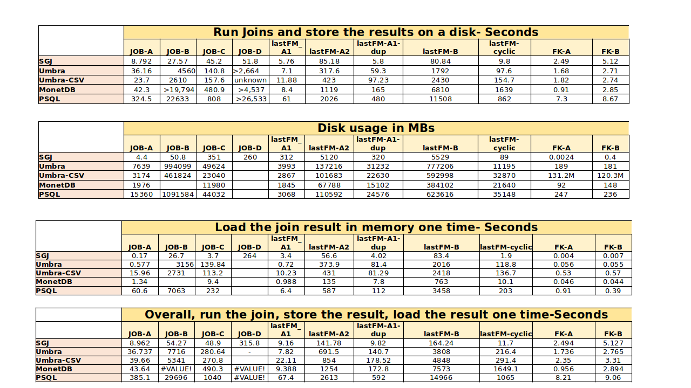
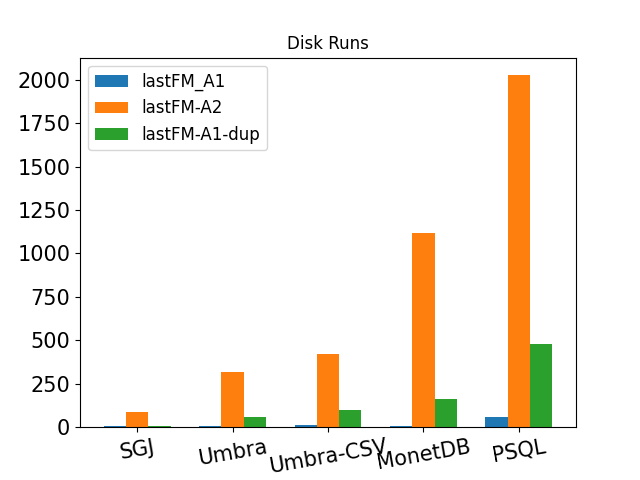
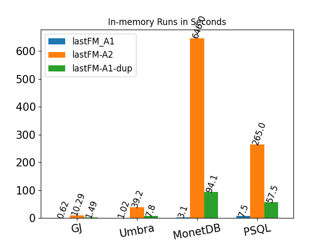
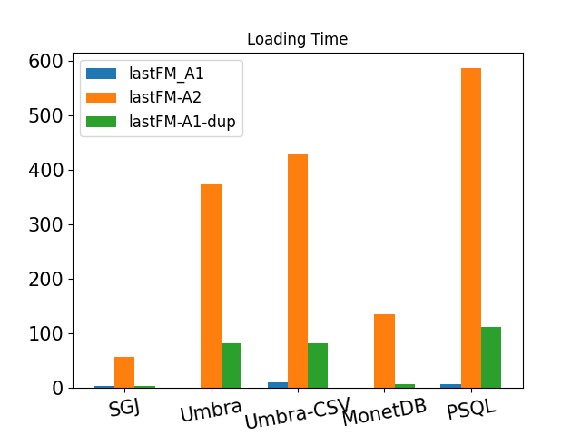
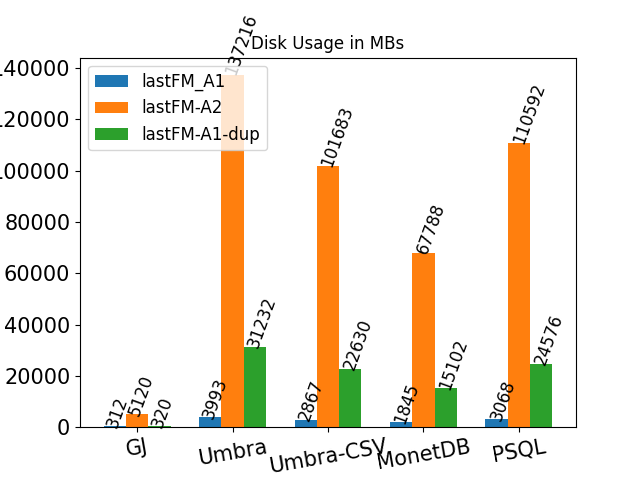
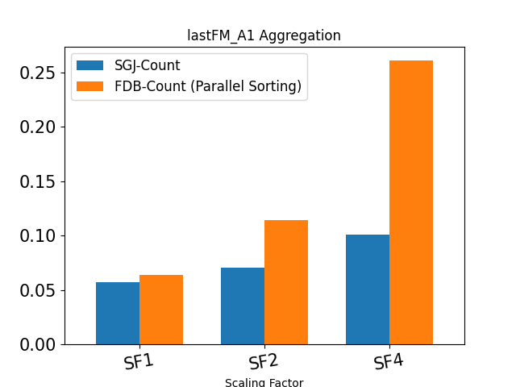
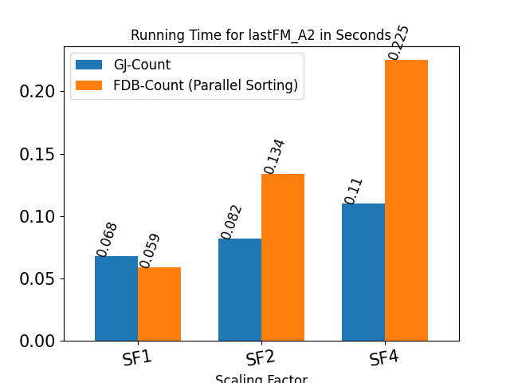
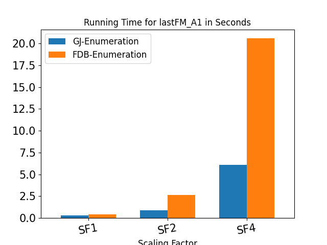
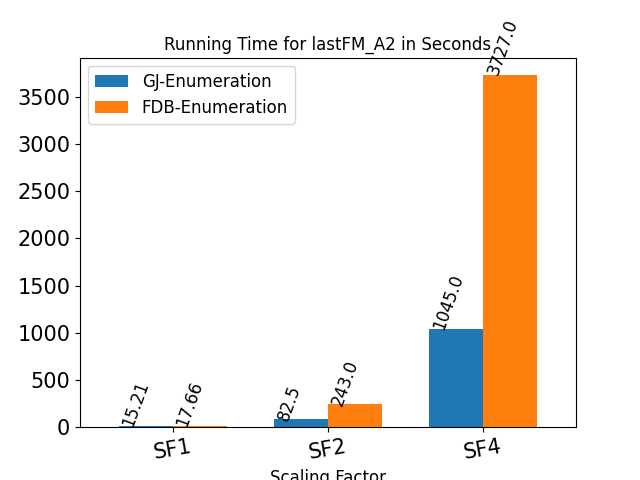

# Graphical_join
A new efficient and scalable physical join algorithm on relational data.   
The algorithm is considered as a worst-case optimal join algorithm.  

The code has been tested on Ubuntu 18.10

# To compile:
First cd into the folder "Graphical_join-main" then run “make -f Makefile CONF=Release”
# The Data:
You can generate the TPCH data by following the instructions provided in http://www.tpc.org/  
For the JOB data and queries refer to https://github.com/gregrahn/join-order-benchmark.  
For lastFM data refer to https://grouplens.org/datasets/hetrec-2011/  
Note, all the data files should be in .csv format including the headers as attribute names, and the delimiter should be '|'. All the data types should be integers. Make sure you give the same index per distinct value in all the tables.  
# To run:
CD into “Graphical_join-main/dist/Release/GNU-Linux” then run “./graphicaljoin” with the appropriate arguments.  
The main arguments are as follows:  
--input /path/to/source/CSVs  
--output /path/for/result  
--query q_name  we have already implemented a few queries  JOB_A, JOB_B, JOB_C, JOB_D, tpch_fk1,tpch_fk2, lastFM_A1, lastFM_A2, lastFM_B  
--gen_mode [1-5] the generation mode. If 5 is chosen, the join result will be generated in the memory, and also the join summary will be stored in disk and then the join summary will be loaded in memory again and the de-summarization will be carried out. The Wall time will be provided per step.   
--max_init default=200000000 specifies the maximum vector size in de-summarization. set with smaller values if you have a small RAM.   
# An example: 
./graphicaljoin --input /path2integerCSVs/ --output ./output/ --query JOB_A --gen_mode 5 --max_init 200000000  

# Results
The results are as below. We compare our GJ algorithm against PSQL, MonetDB, and Umbra.
For more info, please refer to our Graphical Join paper, "To Be Available Soon".  

  

To see the effect of the two sources of inefficiency with joins (unneeded intermediate join result and redundancy), please have a look at the below figures for lastFM-A1, lastFM-A1-dup and lastFM-A2 queries. lastFM-A1 has less unneeded intermediate result and less redundancy, while lastFM-A1-dup contains more redundancy and the lastFM-A2 query has more unneeded intermediate results. The Y-axis is the running time in seconds. The storage cost is in MBs. The results show that GJ is not affected by unneeded intermediate result and the redundancy in the join result.

  

Although we aim to introduce an algorithm to join the tables and store/restore the result to/from a disk, we can also do aggregations over join result. One of the competitors for aggregations is FDB (factorized databases) from https://fdbresearch.github.io/. FDB does not store-restore the join result and it does not generate the flat join result. The authors say they can enumerate the join result, but there is no implementation for that.   

The below results are for FDB and GJ to calculate the count aggregation over joins with different scaling factors of lastFM data. The figures show that by increasing the scaling factor, GJ gains better performance as FDB works with the factorized data, but not factorized distributions.

The enumeration algorithm of the FDB could be similar to our algorithm presented in our graphical join paper, but with the difference that GJ can generate the result columnar as it has the frequencies, but FDB must enumerate the result tuples row-oriented. The below results are for GJ columnar generation and row-oriented generation (The second one can approximately reflect the FDB's enumeration performance). The figures show the GJ is better in tuple enumeration as well.

